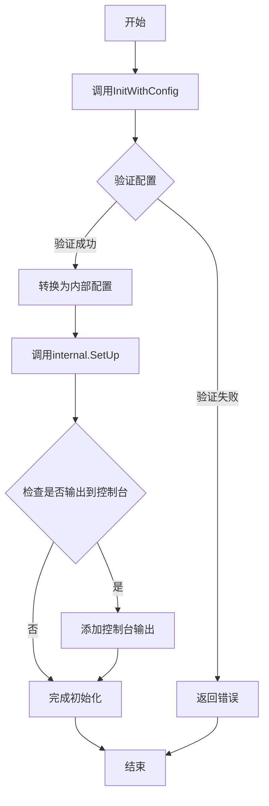
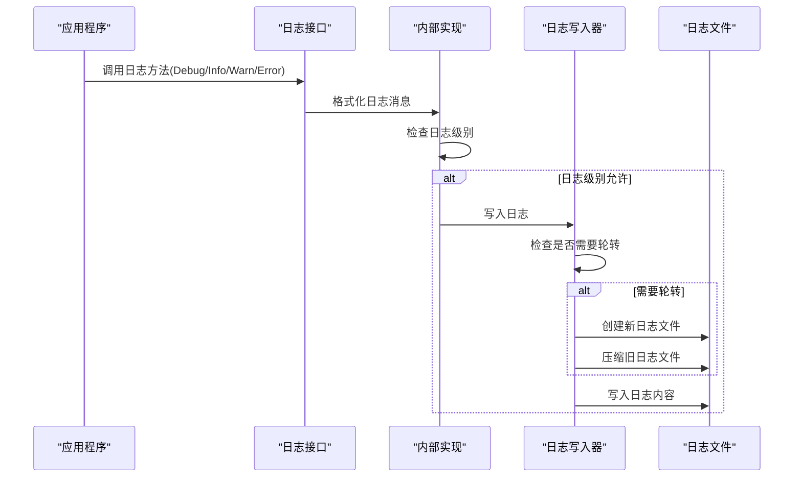
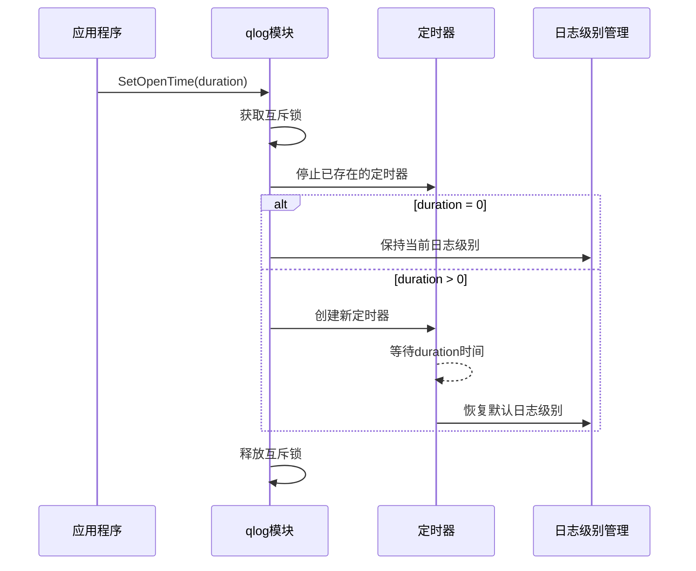
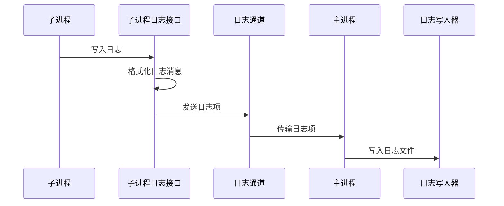
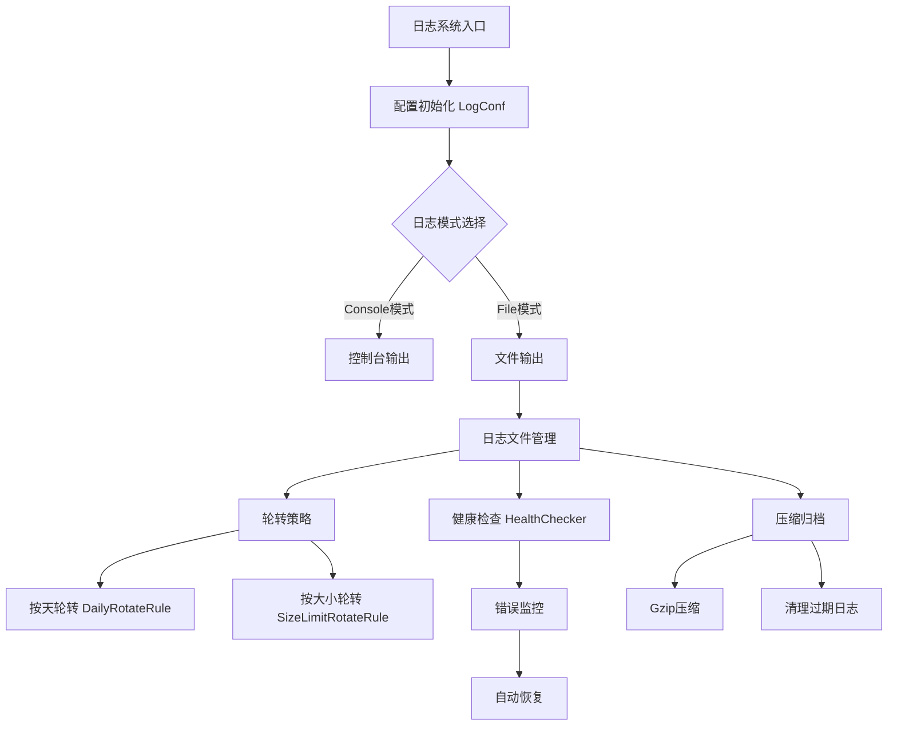
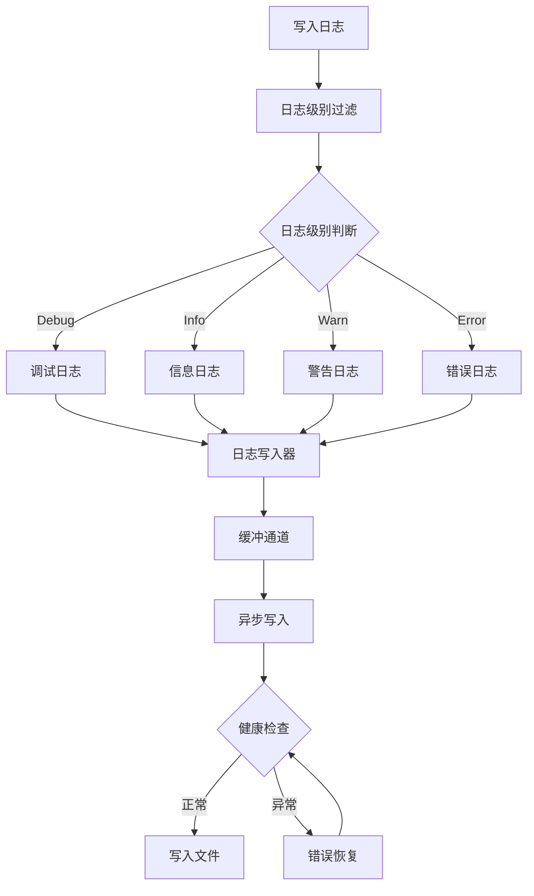

[](https://deepwiki.com/FortuneW/qlog)

# qlog

一个轻量级、高性能的Go日志库，支持多种日志级别、日志轮转、控制台和文件输出等功能。

## 项目简介

qlog是一个专为Go应用程序设计的日志处理库，提供了简单易用且功能强大的日志记录功能。它支持多种日志级别、日志文件自动轮转、压缩、控制台和文件输出等特性，同时提供了链路追踪和性能监控功能。

## 快速开始

```go
// 安装
// go get github.com/FortuneW/qlog

// 导入
import "github.com/FortuneW/qlog"

// 初始化
config := qlog.Config{
    ServiceName: "tts",
    ServerLogDir: "./logs/server",
    ManagerLogDir: "./logs/manager",
    MaxBackups: 7,
    MaxSize: 100,
    Level: "INFO",
    Compress: true,
    Rotation: "size",
    Mode: "file",
    ToConsole: true,
}

err := qlog.InitWithConfig(config)
if err != nil {
    panic(err)
}

defer qlog.UnInit()

// 获取日志记录器并记录日志
rlog := qlog.GetRLog("main")
rlog.Info("应用程序已启动")
rlog.Warn("这是一条警告信息")
rlog.Error("这是一条错误信息")
```

## 1. 整体设计

## 1. 整体设计

### 1.1 模块功能

qlog是一个轻量级日志处理模块,提供以下核心功能:

- 支持五种日志级别(TRACE/DEBUG/INFO/WARN/ERROR)及DISABLE级别
- 支持日志文件自动轮转和压缩
- 支持文件和控制台两种输出模式
- 提供三种日志记录器(RLogger/ALogger/ELogger)
- 支持临时提升日志级别功能
- 支持链路追踪
- 控制台日志级别带颜色输出

### 1.2 核心接口

- RLogger: 运行日志接口
    - Trace/Debug/Info/Warn/Error: 基础日志方法
    - Tracef/Debugf/Infof/Warnf/Errorf: 格式化日志方法
    - WithTraceId: 支持链路追踪
- ALogger: 访问日志接口(用于管理接口)
    - Print: 基础打印方法
    - Printf: 格式化打印方法
- ELogger: 子进程日志接口
    - 继承RLogger全部方法
    - GetPopELogItemChannel: 获取日志channel

## 2. 详细设计

### 2.1 日志级别管理

- 支持级别:
    - TRACE (TRA)
    - DEBUG (DEB)
    - INFO (INF)
    - WARN (WAR)
    - ERROR (ERR)
    - DISABLE (OFF)
- 相关方法:
    - CheckLogLevelStr: 检查日志级别有效性
    - GetLogLevelStr: 获取当前日志级别
    - SetLogLevelStr: 设置日志级别

### 2.2 配置管理

- 配置项:
    - ServiceName: 服务名称
    - ServerLogDir: 服务日志目录
    - ManagerLogDir: 管理日志目录
    - MaxBackups: 最大备份数量(1-100)
    - MaxSize: 单文件最大尺寸(1-1024MB)
    - KeepDays: 日志保留天数
    - Level: 日志级别(TRA/DEB/INF/WAR/ERR/OFF)
    - Compress: 是否压缩
    - Rotation: 轮转方式(size/time)
    - Mode: 输出模式(file/console)
    - ToConsole: 是否同时输出到控制台

### 2.3 日志轮转

- 支持两种轮转方式:
    - 基于大小(size): 超过MaxSize触发轮转
    - 基于时间(time): 按时间周期轮转
- 轮转特性:
    - 自动压缩旧日志文件(.gz)
    - 控制备份文件数量(MaxBackups)
    - 支持删除过期日志(KeepDays)

### 2.4 临时日志级别

- SetOpenTime: 设置临时提升日志级别
    - duration=0: 永久生效
    - duration>0: 临时生效指定时间
- GetOpenTime: 获取当前设置
    - 返回>0: 剩余生效时间
    - 返回=0: 永久生效
    - 返回=-1: 已失效

## 3. 核心流程

### 3.1 初始化流程



### 3.2 日志写入流程



### 3.3 临时日志级别流程



### 3.4 子进程日志流程



### 3.5 internal 日志主流程逻辑

#### 3.5.1 内部模块设计



#### 3.5.2 日志写入流程



## 4. 使用示例

### 4.1 基础初始化

```go 
config := qlog.Config{
    ServiceName: "tts",
    ServerLogDir: "/path/to/server/logs",
    ManagerLogDir: "/path/to/manager/logs", 
    MaxBackups: 7,
    MaxSize: 100,
    Level: "ERR",
    Compress: true,
    Rotation: "size",
    Mode: "file",
    ToConsole: true,
}

err := qlog.InitWithConfig(config)
if err != nil {
    panic(err)
}
```

### 4.2 获取日志记录器

```go 
rlog := qlog.GetRLog("module_name")
rlog.Trace("这是一条追踪日志")
rlog.Debug("这是一条调试日志")
rlog.Info("这是一条信息日志")
rlog.Warn("这是一条警告日志")
rlog.Error("这是一条错误日志")

// 带追踪ID的运行日志
// 已在前面的示例中更新
tracedLog.Info("带追踪ID的日志")

alog := qlog.GetALog()
alog.Print("访问日志")
alog.Printf("格式化的访问日志: %s", "example")

elog := qlog.GetELog("subprocess_module_name")
elog.Info("子进程信息")
```

### 4.3 性能追踪

```go 
// 使用TimeTrackWithDebug追踪函数执行时间
defer qlog.TimeTrackWithDebug(rlog, "test")()

// 使用TimeTrackWithTrace追踪函数执行时间
defer qlog.TimeTrackWithTrace(rlog, "test")()

// 使用TimeTrackWithInfo追踪函数执行时间
defer qlog.TimeTrackWithInfo(rlog, "test")()
```

## 5. 注意事项

1. 如果需要写入文件则使用前必须先调用InitWithConfig()进行初始化
1. 在文件模式下,ServerLogDir和ManagerLogDir不能为空
1. 程序退出前建议调用UnInit()清理资源
1. 日志级别字符串不区分大小写
1. 子进程日志(ELogger)通过channel传递日志到主进程
1. 临时提升日志级别后会自动恢复默认级别

## 6. 许可证

本项目采用 [MIT许可证](LICENSE)。
